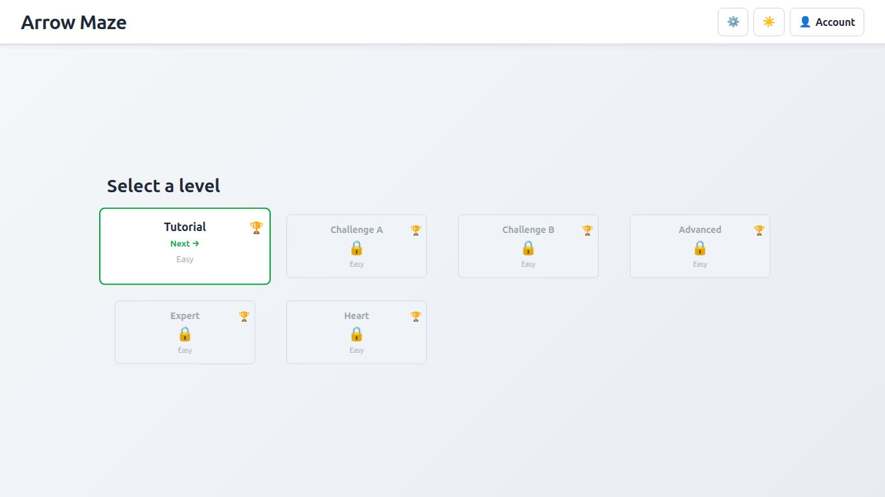
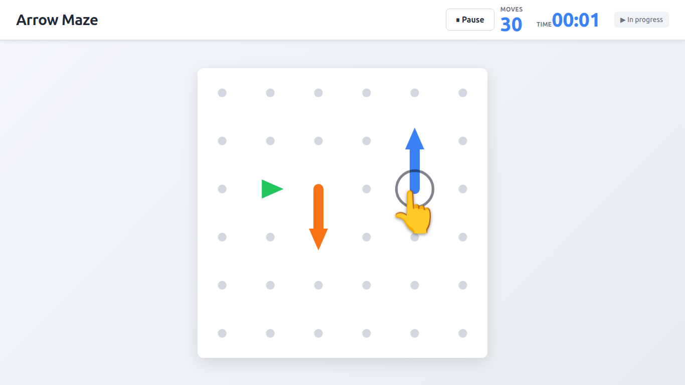
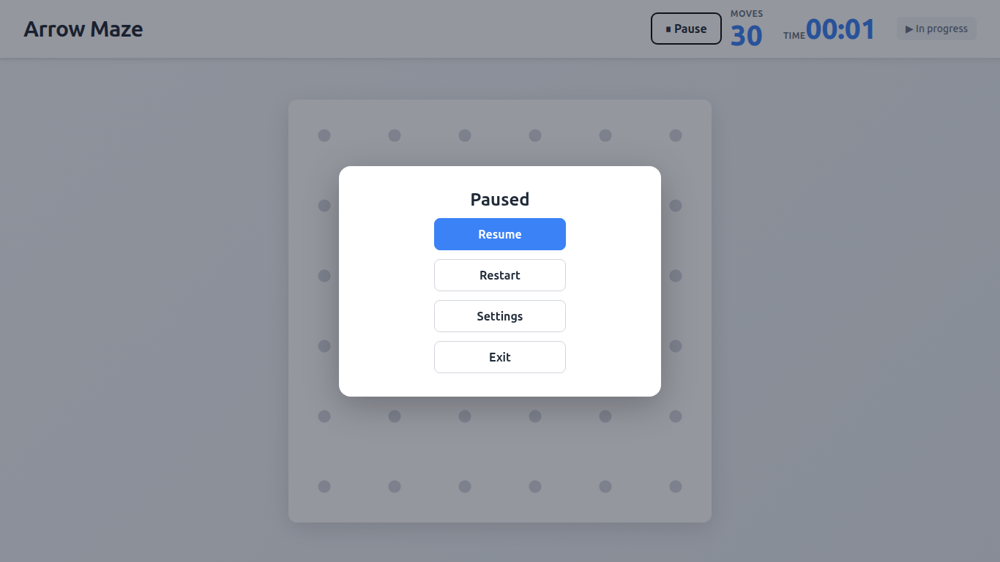
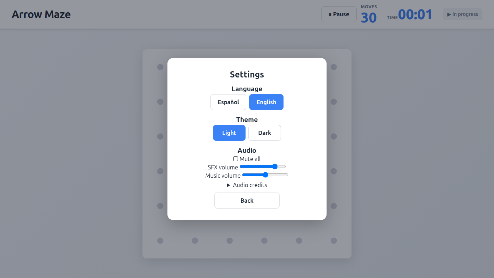
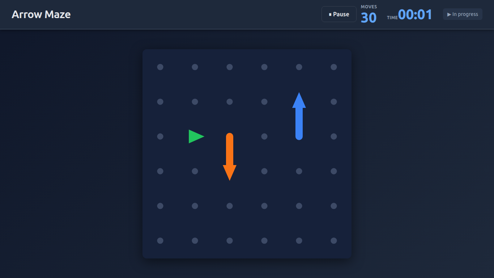
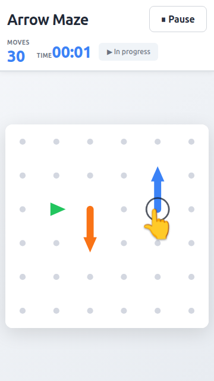

# Arrow Maze — Client


> Implementación del cliente (React + TypeScript + Vite + Capacitor) para el juego de puzzle de flechas. Especificaciones y decisiones centralizadas en [`arrowmaze-project-core`](https://github.com/NRC25783-G4-ArrowMaze/arrowmaze-project-core).

---

## ⚠️ Referencia — Fuente única de verdad

**Las especificaciones, decisiones de arquitectura y roadmap están centralizados en `arrowmaze-project-core`:**

- 📋 **Specs Gherkin:** `features/` (sincronizados con project-core)
- 🗂️ **Matriz de features:** [`arrowmaze-project-core/docs/FEATURES.md`](https://github.com/NRC25783-G4-ArrowMaze/arrowmaze-project-core/blob/main/docs/FEATURES.md)
- 🏗️ **Arquitectura:** [`arrowmaze-project-core/CLAUDE.md`](https://github.com/NRC25783-G4-ArrowMaze/arrowmaze-project-core/blob/main/CLAUDE.md)
- 📝 **Historial SDD:** [`arrowmaze-project-core/.ai-usage/`](https://github.com/NRC25783-G4-ArrowMaze/arrowmaze-project-core/tree/main/.ai-usage)

---

## Descripción

**Arrow Maze** es un juego de puzzle donde el jugador coloca y dirige flechas sobre un tablero representado como un grafo pasivo de nodos conectados por puertos. Las flechas son entidades activas (listas enlazadas) que se desplazan autónomamente por el grafo siguiendo la topología de conexiones.

El cliente está construido como una aplicación web con soporte móvil nativo vía **Capacitor**.

---

## Demo

| Selección de niveles | Partida en curso |
|---|---|
|  |  |

| Pausa | Ajustes (idioma · tema · audio) |
|---|---|
|  |  |

| Tema oscuro | Móvil (360×640) |
|---|---|
|  |  |

> Capturas tomadas de la `v1.0.0` corriendo en local (Vite dev server). Más viewports en [`doc/screenshots/`](./doc/screenshots/).

---

## Stack tecnológico

| Herramienta | Rol |
|---|---|
| **Vite + React** | Framework de presentación y bundler |
| **TypeScript** (`strict: true`) | Lenguaje base — sin `any` |
| **Capacitor** | Wrapper nativo para iOS / Android |
| **Jest** | Tests unitarios y de integración |
| **pnpm** | Gestor de paquetes (obligatorio) |
| **PlantUML** (`tplant`) | Generación de diagramas de clase desde código |

---

## Arquitectura

El proyecto sigue **Clean Architecture** en 4 capas. La dependencia fluye de afuera hacia adentro:

```
presentation ──► infrastructure ──► application ──► domain
```

```
src/
├── domain/               # Lógica pura. Sin dependencias externas.
│   ├── entities/         # Arrow, Head, Segment, ArrowSegment, Board, Cell, GameSession, LevelProgress
│   ├── value-objects/    # Port, AdvanceResult, Score, ScoringConstants, ScoringTracker
│   ├── services/         # TopologyValidator, TopologyQueryService, PathChecker
│   ├── repositories/     # ILevelRepository (puerto definido en dominio)
│   └── errors/           # ArrowErrors, BoardErrors, GameErrors, SyncErrors, ProgressErrors
├── application/          # Casos de uso + DTOs + puertos + servicios de aplicación
│   ├── use-cases/        # BuildBoardUseCase, LevelLoader, PlaceArrowUseCase, AdvanceArrowUseCase,
│   │                     # PlayMoveUseCase, SlideArrowUseCase, QueryTopologyUseCase,
│   │                     # SaveLocalProgress, GetLocalProgress, SyncOfflineProgress, SyncProgress
│   ├── dtos/             # ArrowDTOs, MovementDTOs, GameDTOs, SessionDTOs, SlideDTOs, LevelDataDTOs
│   ├── services/         # LevelDataArrowBuilder, LevelDataBoardBuilder
│   └── ports/            # IArrowBuilder, IBoardBuilder, ILocalProgressRepository,
│                         # IProgressApiClient, IAuthTokenProvider
├── infrastructure/       # Adaptadores y repositorios
│   ├── repositories/     # InMemoryLevelRepository
│   ├── persistence/      # sqlite/ (CapacitorSqliteDriver, SqliteProgressRepository, mapper, model)
│   ├── api/              # FetchProgressApiClient
│   ├── auth/             # CapacitorTokenProvider
│   ├── factories/        # LocalProgressModuleFactory (composition root de persistencia/sync)
│   └── config/
└── presentation/         # UI React, controlador de juego, input y render
    ├── components/       # BoardComponent, ArrowComponent, CellComponent, GameOverlay, ...
    ├── game/             # GameController, useGameController, scene, sampleLevel(2)
    ├── input/            # useBoardInput, tapResolver, PlayMoveCommand
    ├── rendering/        # boardLayout
    └── preview/          # mockScene, heartScene, NeonInteractiveBoard
```

---

## Design Patterns (GoF)

### Factory Method — `LocalProgressModuleFactory`

Ensambla el módulo de persistencia local + sincronización (driver SQLite, cliente HTTP y los
casos de uso que dependen de ellos) detrás de un único punto de construcción, para que el resto
de la app no conozca los detalles de infraestructura concretos.

```ts
// src/infrastructure/factories/LocalProgressModuleFactory.ts
export class LocalProgressModuleFactory {
  public static async create(
    apiBaseUrl: string,
    tokenProvider: IAuthTokenProvider
  ): Promise<LocalProgressModule> {
    const driver = new CapacitorSqliteDriver();
    await driver.openDatabase('game_progress_db');

    const repository = new SqliteProgressRepository(driver);
    await repository.initialize();

    const apiClient = new FetchProgressApiClient(apiBaseUrl, tokenProvider);

    return {
      saveLocalProgress: new SaveLocalProgress(repository),
      getLocalProgress: new GetLocalProgress(repository),
      syncOfflineProgress: new SyncOfflineProgress(repository),
      syncProgress: new SyncProgress(repository, apiClient),
    };
  }
}
```

### Adapter — `FetchProgressApiClient`

Adapta el contrato HTTP real del backend (`fetch`, headers, DTOs, códigos de estado) al puerto
`IProgressApiClient` que la capa de aplicación conoce. La aplicación nunca ve `fetch` ni JSON.

```ts
// src/infrastructure/api/FetchProgressApiClient.ts
export class FetchProgressApiClient implements IProgressApiClient {
  async pushProgress(progress: LevelProgress): Promise<void> {
    const response = await fetch(`${this._baseUrl}/api/v1/progress`, {
      method: 'POST',
      headers: await this.getHeaders(),
      body: JSON.stringify(this.toDTO(progress)),
    });
    if (response.status === 401) throw new SessionExpiredError();
    if (!response.ok) throw new NetworkError(`Error del servidor: ${response.status}`);
  }
}
```

### State (autómata de pila) — `GameFlowController`

El flujo de una partida (ACTIVE / PAUSED / SETTINGS, C1) se modela como una pila de estados en
vez de un enum plano: `openSettings()` solo es válido desde `PAUSED`, `resume()` solo desde
`PAUSED`, etc. — las transiciones inválidas lanzan `InvalidFlowTransitionError` en vez de dejar
la UI en un estado inconsistente.

```ts
// src/application/services/GameFlowController.ts
export class GameFlowController {
  pause(): void {
    if (this.current !== 'ACTIVE' || this._session.status !== 'IN_PROGRESS') {
      throw new InvalidFlowTransitionError('pause', this.current);
    }
    this._stack.push('PAUSED');
  }

  resume(): void {
    if (this.current !== 'PAUSED') {
      throw new InvalidFlowTransitionError('resume', this.current);
    }
    this._stack.pop();
  }
}
```

---

## SOLID en el código

| Principio | Evidencia |
|-----------|-----------|
| **S — Single Responsibility** | Casos de uso de una sola responsabilidad: `SaveLocalProgress`, `GetLocalProgress`, `SyncProgress` viven separados en vez de un "ProgressService" monolítico |
| **O — Open/Closed** | `InMemoryLevelRepository` implementa `ILevelRepository`; se puede añadir un repositorio SQLite o remoto sin tocar el dominio ni los casos de uso |
| **L — Liskov Substitution** | Cualquier `I*ApiClient` (`FetchAuthApiClient`, `FetchProgressApiClient`, `FetchLevelApiClient`, `FetchLeaderboardApiClient`) es sustituible donde su puerto se use, sin romper el contrato |
| **I — Interface Segregation** | Puertos finos y de propósito único en `src/application/ports/` (11 interfaces, p. ej. `IClock`, `IAudioPreferences`, `ILocalProgressRepository` — ver contrato abajo) en vez de una interfaz de infraestructura gigante |
| **D — Dependency Inversion** | Los casos de uso dependen de abstracciones (`IProgressApiClient`), nunca de `fetch` directo; la implementación concreta se inyecta desde `LocalProgressModuleFactory` |

```ts
// src/application/ports/ILocalProgressRepository.ts — puerto segregado (I),
// del que dependen los casos de uso sin conocer SQLite (D)
export interface ILocalProgressRepository {
  initialize(): Promise<void>;
  findByLevelId(levelId: string): Promise<LevelProgress | null>;
  findAll(): Promise<LevelProgress[]>;
  save(progress: LevelProgress): Promise<void>;
  findPendingSync(): Promise<LevelProgress[]>;
  markAsSynced(levelId: string): Promise<void>;
}
```

---

## Diagrama de clases

Generado con `pnpm gen-uml` (tplant) a partir de `src/**/*.ts`. Versión navegable en SVG:
[`doc/classes.svg`](./doc/classes.svg) · fuente editable: [`classes.puml`](./classes.puml).

---

## Features — Estado sincronizado con arrowmaze-project-core

> **Leyenda:** ✅ Implementado · ⚠️ Parcial · ❌ Pendiente · 📝 Spec lista (sin implementar)
>
> **Fuente única de verdad:** [`arrowmaze-project-core/docs/FEATURES.md`](https://github.com/NRC25783-G4-ArrowMaze/arrowmaze-project-core/blob/main/docs/FEATURES.md)
>
> Para detalles de decisiones de diseño, ver `.ai-usage/` en project-core.

### Grupo A — Motor de juego

| # | Feature | Depende de | Estado |
|---|---|---|---|
| [A1](./features/A1-board_graph.feature) | Inicialización y representación del tablero como grafo de nodos en memoria | — | ✅ Implementado |
| [A2](./features/A2-arrow_placement.feature) | Definición y colocación de entidades como listas enlazadas sobre el grafo | A1 | ✅ Implementado |
| [A3](./features/A3-arrow_movement.feature) | Resolución y desplazamiento de entidades direccionales | A1, A2 | ✅ Implementado |
| [A4](./features/A4-game_end_detection.feature) | Detección de victoria por vaciado del tablero y de derrota por agotamiento de movimientos disponibles | A3 | ✅ Implementado |
| [A5](./features/A5-game_session_scoring.feature) | Cálculo y composición de la puntuación por sesión de juego | A4 | ✅ Implementado |

### Grupo B — Renderizado y presentación

| # | Feature | Depende de | Estado |
|---|---|---|---|
| [B1](./features/B1-board-rendering.feature) | Renderizado visual del tablero y sus entidades sobre el grafo de nodos | A1, A2 | ✅ Implementado (SVG) |
| [B2](./features/B2-animation_feedback.feature) | Sistema de animaciones y retroalimentación visual de acciones del motor | A3, B1 | ✅ Implementado |
| [B3](./features/B3-input-routing.feature) | Captura y enrutamiento de la entrada del jugador hacia el motor de juego | B1 | ✅ Implementado |

### Grupo C — Flujo y estados del juego

| # | Feature | Depende de | Estado |
|---|---|---|---|
| [C1](./features/C1-maquina_estados_partida.feature) | Máquina de estados del flujo de una partida (autómata de pila: ACTIVE/PAUSED/SETTINGS) | A4 | ✅ Implementado (`GameFlowController`, PR #22/#23) |
| [C2](./features/C2-carga-deserializacion-niveles.feature) | Carga y deserialización de definiciones de niveles desde archivos locales | A1, A2 | ✅ Implementado |
| [C3](./features/C3-seleccion-niveles-progreso.feature) | Pantalla de selección de niveles con indicador de progreso y control de desbloqueo | C2, D1 | ✅ Implementado (`LevelSelectScreen` + `LevelSelectionProjection`, progreso wired desde `App.tsx`) |
| [C4](./features/C4-pantallas-soporte.feature) | Pantallas de soporte del juego (inicio, victoria, derrota, pausa, ajustes) | C1 | ⚠️ Parcial — `GameOverlay` (victoria/derrota), `PauseOverlay`, `SettingsOverlay` implementados; no hay una pantalla de inicio separada del selector de niveles |

### Grupo D — Persistencia local

| # | Feature | Depende de | Estado |
|---|---|---|---|
| [D1](./features/D1-persistencia-local.feature) | Persistencia local del progreso y puntuaciones del jugador en SQLite | A5 | ✅ Implementado — escritura y lectura (`SqliteProgressRepository`, `SaveLocalProgress`, `GetLocalProgress`) wired en `App.tsx` y consumidas por `LevelSelectScreen` (C3) |
| [D2](./features/D2-sincronizacion-local-remota.feature) | Sincronización del progreso local con el servidor remoto | D1, E2 | ✅ Implementado — upstream/downstream (`SyncProgress`, wired en `App.tsx`/`GameView`); conflictos resueltos conservando el registro superior (`LevelProgress.isBeatenBy`, P21) |

### Grupo E — Identidad y sesión

| # | Feature | Depende de | Estado |
|---|---|---|---|
| [E1](./features/E1-register_and_login.feature) | Registro e inicio de sesión de usuario | — | ✅ Implementado — backend congelado en v1.0.0; UI de cuenta en cliente (`LoginUser`, `RegisterUser`, #38) |
| [E2](./features/E2-active_session_management.feature) | Gestión de sesión activa y renovación de credenciales JWT | E1 | ⚠️ Parcial — persistencia de token/email y logout en 401 (`CapacitorTokenProvider`, `LogoutUser`, badge #43); sin flujo explícito de renovación (refresh) de JWT |

### Grupo F — Backend / API REST

| # | Feature | Depende de | Estado |
|---|---|---|---|
| [F1](./features/F1-api_users_auth.feature) | API de autenticación de usuarios (registro, login, logout con JWT) | — | ✅ Implementado — backend congelado en v1.0.0; consumido por `FetchAuthApiClient` |
| [F2](./features/F2-level-api-distribution.feature) | API de distribución y actualización remota de definiciones de niveles | Contrato C2 | ✅ Implementado — backend congelado en v1.0.0; consumido por `FetchLevelApiClient` con fallback offline |
| [F3](./features/F3-recepcion-consulta-progreso.feature) | API de recepción y consulta del progreso del jugador | F1 | ✅ Implementado — backend congelado en v1.0.0; consumido por `FetchProgressApiClient` (`/api/v1/progress`) |
| F4 | Sistema de clasificación por nivel (leaderboard) | F1, F3 | ✅ Implementado — `FetchLeaderboardApiClient`, `GetLevelLeaderboard`, `LeaderboardOverlay` (#46) |

### Grupo G — Características de producto

| # | Feature | Depende de | Estado |
|---|---|---|---|
| [G1](./features/G1-audio-sfx-musica.feature) | Sistema de reproducción de audio, efectos sonoros y música de fondo | B2 | ✅ Implementado — SFX y música por dificultad, con preferencia de silencio (`CapacitorAudioPreferences`, `useGameAudio`, #37) |
| [G2](./features/G2-internacionalizacion.feature) | Soporte de internacionalización y cambio de idioma (ES/EN) | C4 | ✅ Implementado — catálogos ES/EN con test de paridad, cambio en caliente, selector en ajustes (#35) |
| [G3](./features/G3-temporizador-nivel.feature) | Temporizador visual por nivel (mm:ss, pausa, IClock) | C1 | ⚠️ Parcial — temporizador de Presentation implementado (`useLevelTimer`, `LevelTimerDisplay`, #36); integración con el score pendiente (P23) |

### Grupo H — Herramientas internas

| # | Feature | Depende de | Estado |
|---|---|---|---|
| [H1](./features/H1-forge-editor-niveles.feature) | FORGE — Editor visual interactivo de niveles (herramienta ADMIN) | C2, F2 | ✅ Implementado (Fases 0–6, PR #19) |

---

## Conceptos clave del dominio

### Tablero (A1)

El tablero es un **grafo pasivo** de celdas conectadas por puertos indexados. No usa coordenadas cartesianas: dos celdas son vecinas si y solo si comparten una conexión port-to-port.

- `Cell` — contenedor pasivo con $P$ puertos (par obligatorio). Sin reglas de movimiento.
- `Port` — punto de conexión estático, indexado de $0$ a $P-1$.
- `Board` — grafo que gestiona conexiones bidireccionales y el ciclo de vida de las celdas.
- **Exit (salida):** puerto de una celda sin vecino conectado.

### Flechas (A2)

Una flecha es una **lista doblemente enlazada** de `ArrowSegment`:

```
Head → Segment → Segment → ... → Segment(tail)
```

- `Head` — motor direccional. Tiene `exitPort` (dirección de viaje). `prev = null` siempre.
- `Segment` — nodo de cuerpo. Tiene `entryPort` (puerto de entrada), calculado al enlazarse.
- `Arrow` — entidad activa. Única con derecho a llamar `Cell.placeArrowSegment()` y `Cell.removeArrowSegment()`.

### Motor de movimiento (A3)

Algoritmo **Head-push** en 4 fases por tick:

| Fase | Qué hace |
|---|---|
| **Collect** | Lineariza la lista enlazada en un array ordenado |
| **Project** | Calcula `exitDir` y `targetCell` para cada segmento |
| **Validate** | Revisión perezosa (lazy): solo verifica el target de la **cabeza** |
| **Commit** | Libera celdas antiguas, reconstruye la cadena en las celdas destino |

Dirección de salida por tipo de segmento:

| Segmento | Fórmula de `exitDir` |
|---|---|
| Head | `head.exitPort` (almacenado) |
| Body (tiene `next`) | `findConnectingPort(cell, next.cell)` |
| Tail (sin `next`) | `(entryPort + P/2) % P` |

Resultados posibles (`AdvanceOutcome`): `'advanced'` · `'blocked'` · `'destroyed'`

---

## Tests

```
__tests__/
├── domain/          # Unit tests puros — grafo, movimiento, colisiones, sesión, scoring
├── application/     # Integration tests por use case (place, advance, play, slide, load)
├── infrastructure/  # Repositorios (InMemoryLevelRepository)
└── presentation/    # Enrutamiento de input y sesión de juego
```

**228 tests pasando · 20 suites · 0 fallos**

```bash
pnpm test                                 # Suite completa
pnpm test -- --watch                      # Modo watch
pnpm test -- --testPathPatterns="<name>"  # Un spec concreto (Jest 30: flag en plural)
```

---

## Comandos de desarrollo

```bash
# Instalar dependencias
pnpm install

# Servidor de desarrollo
pnpm dev

# Ejecutar tests
pnpm test

# Lint
pnpm lint

# Generar diagrama de clases UML
pnpm gen-uml

# Build de producción
pnpm build
```

---

## Documentación técnica

| Documento | Descripción |
|---|---|
| [`doc/feature1.md`](./doc/feature1.md) | Spec de A1 — Grafo de nodos (Board + Cell) |
| [`doc/feature2_plan.md`](./doc/feature2_plan.md) | Plan de A2 — Arrow Placement |
| [`doc/feature3_plan.md`](./doc/feature3_plan.md) | Plan de A3 — Motor de movimiento |
| [`doc/readme_plan.md`](./doc/readme_plan.md) | Roadmap maestro de los 13 features |
| [`doc/plantuml-generation.md`](./doc/plantuml-generation.md) | Guía de generación de diagramas UML |
| [`classes.puml`](./classes.puml) | Diagrama de clases PlantUML actualizado |
| [`AI_USAGE.md`](./AI_USAGE.md) | Resumen del uso de IA: herramientas, alcance, alucinaciones corregidas y reflexión |
| [`.ai-usage/README.md`](./.ai-usage/README.md) | Registro modular de uso de IA (un reporte por sesión) |
| [`CLAUDE.md`](./CLAUDE.md) | Reglas y convenciones para Claude Code |

---

## Convenciones del proyecto

- **Package manager:** `pnpm` exclusivamente — `npm` y `yarn` están prohibidos.
- **TypeScript:** `strict: true`, sin `any`, `import type` para tipos.
- **Arquitectura:** las capas no se saltan — `infrastructure` nunca llama directamente a `domain`.
- **Errores de dominio:** clases tipadas en `domain/errors/`, nunca `new Error()` plano.
- **TDD:** ciclo Red → Green → Refactor. Ningún código de producción sin test rojo previo.
- **Commits:** convencional commits sugeridos por el agente, ejecutados manualmente.
- **IA:** toda sesión de IA se documenta en `.ai-usage/` antes del merge.

---

## Licencia

MIT — ver [`LICENSE`](./LICENSE).
