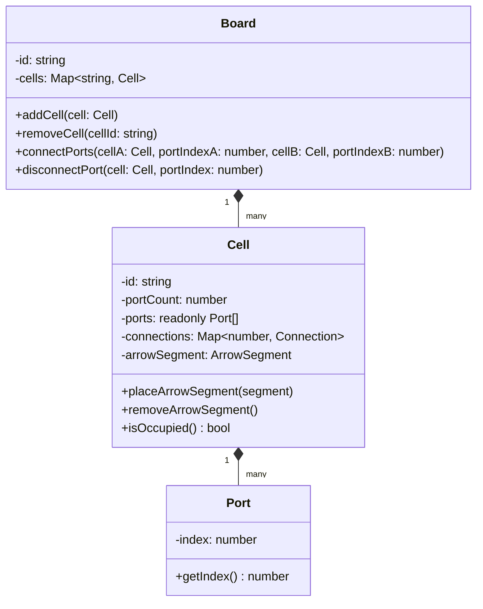

# Feature 1: Tablero como Grafo de Nodos en Memoria

Esta característica implementa la representación y gestión del tablero de juego utilizando una topología de grafo pasivo con puertos indexados, desacoplándolo de cualquier sistema de coordenadas cartesianas o grilla bidimensional.

## Conceptos Clave del Dominio

El diseño sigue los principios de **Clean Architecture** y **DDD (Domain-Driven Design)**:



- **Cell (Celda):** Contenedor pasivo de la red. Cada celda se define únicamente por su cantidad de puertos ($P$), la cual debe ser obligatoriamente un número par. Las celdas no calculan trayectorias ni reglas de movimiento.
- **Port (Puerto):** Puntos de conexión estáticos indexados secuencialmente de $0$ a $P-1$.
- **Board (Tablero):** Grafo contenedor que gestiona el ciclo de vida de las celdas y la consistencia de sus conexiones bidireccionales.
- **Salida (Exit):** Cualquier puerto de una celda que no esté conectado a ninguna celda vecina (apunta al vacío).

---

## Reglas del Negocio y Restricciones de Dominio

### 1. Inicialización de Celdas
- Una celda debe tener un número par de puertos (ej. 4 para cuadrado, 6 para hexágono). Intentar crear una celda con puertos impares lanza un `TopologyError`.
- La capacidad de puertos de una celda es inmutable tras su creación. Cualquier intento de mutar `portCount` lanza un `CellMutationError`.

### 2. Conexiones
- Las conexiones son bidireccionales y asimétricas: si el puerto $X$ de la celda $A$ se conecta al puerto $Y$ de la celda $B$, el puerto $Y$ de $B$ apunta automáticamente a $A$.
- Se prohíbe la auto-conexión (un puerto no puede conectarse a otro puerto de la misma celda).
- Un puerto ya conectado no puede recibir nuevas conexiones sin ser desconectado previamente.

### 3. Ocupación Pasiva (Arrow Segments)
- Las celdas permiten la colocación de un segmento de flecha (`arrowSegment`).
- Un segmento de cabeza (`isHead: true`) puede colocarse en cualquier celda libre.
- Un segmento de cuerpo (`isHead: false`) requiere que la celda tenga al menos dos conexiones activas en el grafo (para garantizar continuidad física).

---

## Estructura de Capas y Componentes

### 1. Capa de Dominio (`src/domain/`)
- **`entities/Cell.ts` y `entities/Board.ts`:** Entidades principales que encapsulan el estado del grafo y sus reglas de mutación.
- **`value-objects/Port.ts`:** Objeto de valor inmutable que representa el índice del puerto.
- **`services/TopologyValidator.ts`:** Validaciones puras estáticas para la consistencia del grafo.
- **`services/TopologyQueryService.ts`:** Consultas de lectura pasiva sobre la topología (vecinos, adyacencias, salidas).
- **`services/PathChecker.ts`:** Algoritmo BFS para evaluar si un punto de inicio tiene camino disponible hacia cualquier salida del tablero.

### 2. Capa de Aplicación (`src/application/`)
- **`use-cases/BuildBoardUseCase.ts`:** Construye una instancia de tablero a partir de la especificación limpia de un nivel.
- **`use-cases/LoadLevelUseCase.ts`:** Carga los metadatos y la topología física de un nivel de manera concurrente.
- **`use-cases/QueryTopologyUseCase.ts`:** Expone consultas del grafo de forma segura hacia las capas externas a través de DTOs (`CellDTO`, `ConnectionDTO`).

### 3. Capa de Infraestructura (`src/infrastructure/`)
- **`factories/BoardFactory.ts`:** Traduce esquemas de datos serializados (`LevelData`) a entidades de dominio, validando la integridad estructural.
- **`repositories/InMemoryBoardRepository.ts`:** Repositorio en memoria que almacena y sirve las configuraciones de los niveles (fixtures de test).

---

## Verificación y Pruebas

El comportamiento del grafo de celdas está completamente respaldado por pruebas unitarias y de integración organizadas en 5 suites de tests en Jest:

1. **`board_graph.spec.ts`:** Valida las reglas de dominio puras (creación de celdas, bidireccionalidad, inmutabilidad, y ocupación).
2. **`BoardFactory.spec.ts`:** Verifica la conversión y manejo de errores durante la deserialización de layouts de celdas.
3. **`BuildBoardUseCase.spec.ts`:** Prueba la construcción y propagación transparente de excepciones de topología.
4. **`LoadLevelUseCase.spec.ts`:** Pruebas del flujo de carga concurrente y deduplicación de enlaces.
5. **`QueryTopologyUseCase.spec.ts`:** Valida consultas seguras y la inmutabilidad del estado consultado.

Para ejecutar los tests locales:
```bash
pnpm test
```
